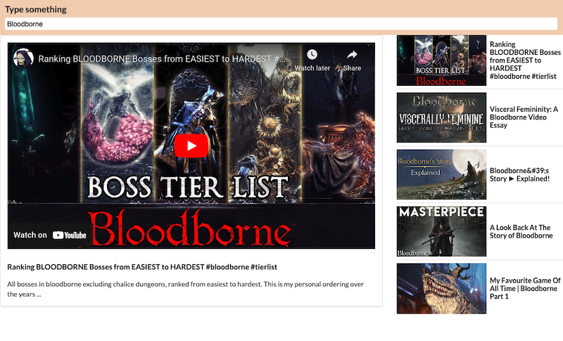

# Items and Details

<em>Browse-A-Vid</em> is a video browsing app built with React.

Search and watch hundreds of videos using Google's Youtube API.

Follow the instructions below to run the app.



## Built with

- create-react-app

- Axios

## Instructions

#### Step 1 - Install dependencies.

```zsh
$ npm install
```

#### Step 2 - Run app.

```zsh
$ npm start
```

### \*\*\* Note: The app will only run on http://localhost:3000/
